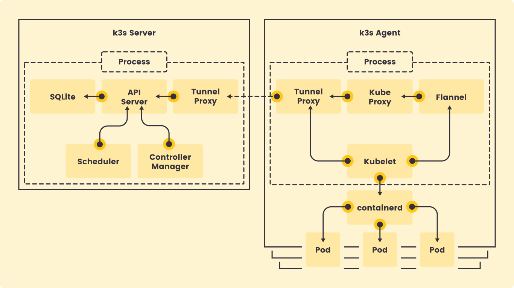

# K3S Notes

K3s is a highly available, certified Kubernetes distribution designed for production workloads in unattended, resource-constrained, remote locations or inside IoT appliances. K3s is packaged as a single 40MB binary that reduces the dependencies and steps needed to install, run and auto-update a production Kubernetes cluster.

By default K3S will use Containerd as a container runtime.  Docker can be used if desired.  Make sure to have Docker installed prior to installing K3S.

The K3S binary has everything needed to act as the Kubernetes control plane, and it also provides the kubectl command. 

Additional info can be found at: https://k3s.io/



## Install K3S on a Single Node
Install via shell script.  
`curl -sfL https://get.k3s.io | sh -`

By default the kubectl command can only be accessed by root.  This install command will let any local account access kubectl. 
`curl -sfL https://get.k3s.io | sh -s - --write-kubeconfig-mode 644`

By default K3S uses ContainerD as it's runtime.  Docker can be used instead with this install command.  Docker needs to be installed beforehand.  
`curl -sfL https://get.k3s.io | sh -s - --write-kubeconfig-mode 644 --docker`

### Check Node status after install 
`kubectl get nodes`

`kubectl describe node <nodename>`

`k3s kubectl get node -o wide`

## Install on Multiple Nodes

### Get the master node's token

Use the above steps to install K3S on one node.  Then get that nodes token with the following command. 

`sudo cat /var/lib/rancher/k3s/server/node-token`

### Add a worker node
Command Syntax to install K3S on worker node then join the cluster
`curl -sfL https://get.k3s.io | K3S_TOKEN=${K3S_TOKEN} K3S_URL=${K3S_NODEIP_MASTER} sh -`

Example of the command to install and join with a token and IP of Master
`curl -sfL https://get.k3s.io | K3S_TOKEN=K10e8c4e0978bcc9d67c3eaf51de7576f4980609c2c67de77bb97e42d4528ea6045::server:a25e143f6524ac9c6f076ea67b028fc9 K3S_URL=https://192.168.68.130:6443 sh -`

Example of the command to install and join using Docker as a container runtime. 
`curl -sfL https://get.k3s.io | K3S_TOKEN=K10e8c4e0978bcc9d67c3eaf51de7576f4980609c2c67de77bb97e42d4528ea6045::server:a25e143f6524ac9c6f076ea67b028fc9 K3S_URL=https://192.168.68.100:6443 sh -s - --docker`

If K3S is already installed on a node and you would like to join it to another this command can be used. 
`sudo k3s agent --server ${K3S_URL} --token ${K3S_TOKEN}`

### Check cluster info
`k3s kubectl cluster-info`

`k3s kubectl get all --all-namespaces`


## K3s Manual Install with Docker as Runtime

This method is for installing K3S without the auto install shell script, and using Docker as the container runtime. Make sure docker is installed on the node.

### Download and Install K3S
Download the K3s Binary, the links can be found at https://github.com/rancher/k3s/releases/latest
example:
`curl -OL https://github.com/rancher/k3s/releases/download/v1.18.8%2Bk3s1/k3s`

```
chmod +x k3s 
sudo mv k3s /usr/local/bin
```

Test with 
`k3s --version`

### Setup K3S

Start K3s Master node with
`sudo k3s server --docker &`

Get the kubeconfig file with
`cat /etc/rancher/k3s/k3s.yaml`

Get the node token with
`sudo cat /var/lib/rancher/k3s/server/node-token`

Install k3s binary on any additional nodes with same steps, but execute with
`sudo k3s agent --docker --server ${K3S_URL} --token ${K3S_TOKEN} &`


### Add as systemd service

On the master node.
Copy this to /etc/systemd/system/k3s.service

```
[Unit]
Description=Lightweight Kubernetes
Documentation=https://k3s.io
Wants=network-online.target

[Install]
WantedBy=multi-user.target

[Service]
Type=notify
EnvironmentFile=/etc/systemd/system/k3s.service.env
KillMode=process
Delegate=yes
LimitNOFILE=infinity
LimitNPROC=infinity
LimitCORE=infinity
TasksMax=infinity
TimeoutStartSec=0
Restart=always
RestartSec=5s
ExecStartPre=-/sbin/modprobe br_netfilter
ExecStartPre=-/sbin/modprobe overlay
ExecStart=/usr/local/bin/k3s \
	server \
		'--write-kubeconfig-mode' \
		'644' \
		'--docker' \
```

Reload systemd

`sudo systemctl daemon-reload`

check the service

`sudo service k3s status`


### On any worker nodes

Add the following to /etc/systemd/system/k3s-agent.service.env 
Replace with apprpriate token and URL

```
K3S_TOKEN=K101b67474c7a4ffc3a1ad970ff47e3b9ce041afc8708a44cea54f865f3a6b28e52::server:3f88109869142782e1ee156cccf84d5c
K3S_URL=https://192.168.68.100:6443
```

/etc/systemd/system/k3s-agent.service
```
[Unit]
Description=Lightweight Kubernetes
Documentation=https://k3s.io
Wants=network-online.target

[Install]
WantedBy=multi-user.target

[Service]
Type=exec
EnvironmentFile=/etc/systemd/system/k3s-agent.service.env
KillMode=process
Delegate=yes
LimitNOFILE=infinity
LimitNPROC=infinity
LimitCORE=infinity
TasksMax=infinity
TimeoutStartSec=0
Restart=always
RestartSec=5s
ExecStartPre=-/sbin/modprobe br_netfilter
ExecStartPre=-/sbin/modprobe overlay
ExecStart=/usr/local/bin/k3s \
	agent \
	'--docker' \
```

